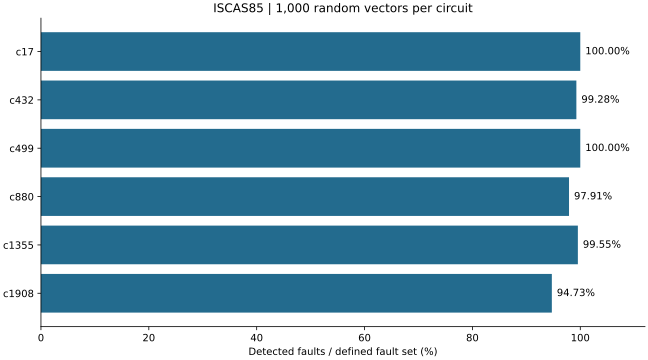

# 02. ISCAS85 회로 결함진단

정상 회로와 단일 stuck-at 결함 회로의 출력을 비교해 검사 벡터의 결함 검출 범위를 평가했습니다. Python으로 구조적 Verilog 넷리스트를 읽고 논리 시뮬레이션을 수행합니다.

## 문제와 접근

검사 패턴을 많이 입력하더라도 모든 결함이 검출되는 것은 아닙니다. 회로별로 검출률과 미검출 결함을 기록하고, 입력 조합이 작은 회로에서는 전수 검사 결과와 비교했습니다.

1. c17·c432·c499·c880·c1355·c1908 넷리스트의 게이트 연결을 파싱하고 의존 순서대로 정렬했습니다.
2. 1차 입력과 게이트 출력의 SA0/SA1 결함을 하나씩 주입했습니다.
3. 회로마다 고정 난수 시드로 1,000개의 검사 벡터를 생성하고 정상 출력과 결함 출력을 비교했습니다.
4. 결함별 최초 검출 시점, 누적 검출률, 미검출 항목을 기록했습니다.
5. c17은 5개 입력의 모든 조합 32개를 적용해 정의한 결함 집합의 검출을 확인했습니다.

## 재실행 결과

| 회로 | 주입 결함 수 | 1,000개 벡터 후 검출률 | 미검출 수 |
|---|---:|---:|---:|
| c17 | 22 | 100.00% | 0 |
| c432 | 414 | 99.28% | 3 |
| c499 | 430 | 100.00% | 0 |
| c880 | 766 | 97.91% | 16 |
| c1355 | 1,118 | 99.55% | 5 |
| c1908 | 1,024 | 94.73% | 54 |
| **합계** | **3,774** | **97.93% (3,696/3,774)** | **78** |



c17의 32개 전수 입력에서도 22개 대상 결함이 모두 검출되었습니다. 재실행 결과는 원본의 회로별 결함 수·검출률·미검출 수와 일치합니다.

## 검증 로직에서 확인한 점

입력 결함은 첫 게이트 계산 전에 반영하고, 내부 네트 결함은 해당 게이트의 출력 계산을 고정값으로 대체해야 후속 게이트에 전파됩니다. `netlist.py`에서 이 순서를 확인할 수 있습니다. 이번 정리에서는 c17 정상 출력도 별도 논리식으로 32개 입력 조합을 대조했습니다.

## 품질관리 관점과 해석 범위

검사 결과뿐 아니라 검사 절차와 검출 범위를 함께 검토하는 경험입니다. 미검출 결함을 목록으로 남겨 후속 패턴 생성이나 추가 검증 대상으로 구분했습니다.

- 검출률의 분모는 **이 코드가 정의한 1차 입력·게이트 출력의 단일 stuck-at 결함 집합**입니다. 분기별 결함, 지연 결함, 브리징 결함, 아날로그 특성 및 실제 제품의 모든 고장을 포함하지 않습니다.
- 1,000개 무작위 벡터에서 미검출되었다는 사실만으로 검출 불가능한 중복 결함이라고 판정할 수 없습니다.
- 실제 FPGA 보드에서의 검사나 HDL 시뮬레이터의 타이밍 검증 결과가 아닌 Python 논리 시뮬레이션입니다.
- 원본 함수명 `checkpoint_faults`를 유지했지만, 모든 분기 결함을 포함하는 체크포인트 정리의 보장을 주장하지 않습니다.

## 실행

```bash
cd circuit-faults
python 01_generate_data.py
python 02_fault_simulation.py
python 03_analysis.py
```

첫 단계는 공개 넷리스트를 `data/`로 내려받습니다. 동일한 넷리스트를 수동 배치하면 건너뜁니다. 두 번째 단계는 `data/fault_results.csv`와 `data/circuit_summary.json`을 생성하며, 세 번째 단계는 그래프와 `summary.json`을 만듭니다.

- [넷리스트 파서·시뮬레이터](netlist.py)
- [결함 주입·전수 검사](02_fault_simulation.py)
- [원본 결과 요약](results/source_summary.json)
- [재실행 검증 기록](results/reproduced_metrics.json)
- [데이터 출처](../DATA_SOURCES.md)
