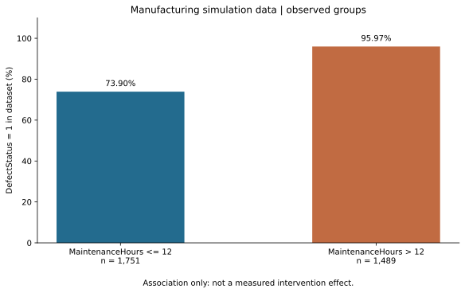

# 제조공정 불량 요인 분석

공개 제조공정 시뮬레이션 데이터 3,240건을 분석해 불량 비율이 달라지는 구간과 관련 변수를 살펴봤습니다. 관리도로 구간별 차이를 확인한 뒤, 분류 모델과 변수별 비교를 통해 추가로 조사할 항목을 정리했습니다.

| 분석 대상 | 사용 도구 | 주요 결과 |
|---|---|---|
| 제조공정 시뮬레이션 데이터 3,240건 | Python, pandas, scikit-learn | 가상 관리도 이탈 구간 4개 확인, 분류 모델 ROC-AUC 약 0.797 |

## 분석 과정

먼저 불량 여부를 나타내는 `DefectStatus`를 분석 기준으로 정했습니다. 실제 생산 시각과 로트 정보가 없어 행 50개를 하나의 가상 로트로 묶고, 로트별 불량 비율을 p-관리도로 비교했습니다. 전체 3,240건으로 중심선을 계산하고, 50건이 채워진 64개 로트를 표시했습니다.

그 결과 4개 로트가 관리하한보다 낮게 나타났습니다. 불량이 증가한 구간이 아니라 불량 비율이 이례적으로 낮은 구간이므로, 데이터 구성과 구간 간 차이를 살펴볼 대상으로 구분했습니다.

다음으로 변수 간 상관관계를 확인하고 Random Forest 모델을 학습했습니다. 이 데이터는 불량으로 표시된 비율이 약 84%로 높아 정확도만으로 모델을 평가하기 어려웠습니다. 따라서 양성과 음성을 구분하는 성능을 나타내는 ROC-AUC를 함께 확인했으며, 평가 결과는 약 0.797이었습니다.

## 유지보수시간에 따른 차이

모델의 변수중요도에서 유지보수시간(`MaintenanceHours`)이 가장 높게 나타났습니다. 이를 구간별로 나눠 실제 데이터에 기록된 불량 비율을 비교했습니다.

| 유지보수시간 | 데이터 수 | 불량으로 표시된 비율 |
|---|---:|---:|
| 12시간 이하 | 1,751건 | 73.90% |
| 12시간 초과 | 1,489건 | 95.97% |



12시간을 넘는 구간에서 불량 비율이 높게 나타났지만, 이 결과만으로 유지보수시간이 불량의 원인이라고 확정할 수는 없었습니다. 설비 문제가 많아 유지보수시간이 길어졌을 가능성도 있어, 실제 현장에서는 고장 이력과 정비 내용을 함께 확인해야 합니다.

## 조건을 바꾼 모델 예측

12시간 초과 그룹의 유지보수시간을 6시간으로 바꾸고 나머지 변수는 유지한 채 모델의 예측을 비교했습니다. 기존 분석에서 해당 그룹의 평균 예측 불량 확률은 약 95.8%에서 73.7%로 낮아졌습니다.

이 수치는 **입력 조건을 바꿨을 때의 모델 예측값**입니다. 실제 공정의 개선 효과로 판단하려면 원인조사와 별도 실험이 필요하며, 유지보수를 줄이는 조치의 근거로 사용할 수는 없습니다. 분석에서는 이 차이를 추가 검증할 가설로 남겼습니다.

관리도 이탈 방향을 구분하고, 모델에서 중요하게 나타난 변수를 실제 구간별 데이터와 대조한 것이 이 분석의 핵심입니다. 관측된 차이와 모델의 예측을 구분하면서 원인조사에 필요한 근거를 정리했습니다.

## 분석 조건

행 순서로 만든 가상 로트이므로 관리도는 통계적 공정관리 방법을 적용한 실습입니다. 시나리오 계산에는 학습에 사용한 표본도 포함되어 있습니다. 12시간 경계와 관리 규칙은 이 데이터에서 검토한 기준이며, 현장 운영 기준으로 검증된 값은 아닙니다. 세부 계산 조건과 재실행 차이는 [검증 기록](../VALIDATION.md)에서 확인할 수 있습니다.

## 코드와 실행 방법

[분석 코드](01_analysis.py) · [기존 분석 결과](results/source_summary.json) · [재실행 결과](results/reproduced_metrics.json)

[데이터 준비 안내](../DATA_SOURCES.md)에 따라 CSV를 `data/manufacturing_defect_dataset.csv`로 배치한 뒤 실행합니다.

```bash
cd manufacturing-defects
python 01_analysis.py
```

결과 그래프는 `figures/`에, 해당 실행의 수치는 `summary.json`에 저장됩니다.
