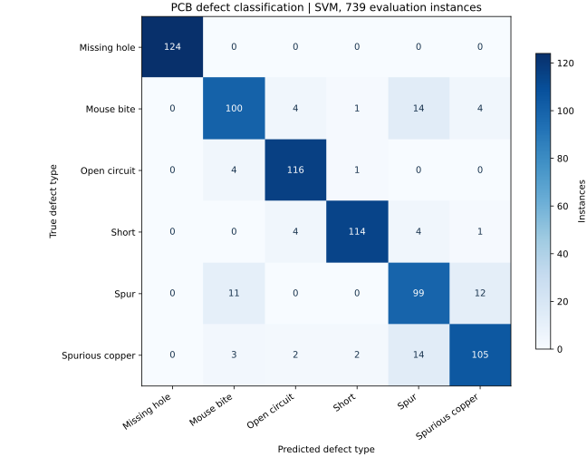

# 01. PCB 결함 유형 분류

주석으로 위치가 주어진 PCB 결함을 6종으로 분류하고, 어떤 유형에서 오분류가 발생하는지 분석한 프로젝트입니다.

## 문제와 접근

전체 정확도만으로는 특정 결함의 분류 취약점을 알기 어렵습니다. 결함 영역의 특징을 추출하고 모델별·유형별 지표를 비교해 재검토가 필요한 유형을 찾았습니다.

1. PASCAL VOC XML 주석에서 결함 좌표와 라벨을 읽었습니다. 분석 대상은 이미지 693장에 포함된 결함 인스턴스 2,953개입니다.
2. 결함 영역을 64×64로 변환하고, 기하·밝기 특징 9개와 HOG 특징 36개를 결합했습니다.
3. 75:25 층화 분할로 학습 2,214개와 평가 739개를 구성했습니다. Random Forest와 표준화 후 RBF-SVM을 비교했습니다.
4. 혼동행렬과 유형별 Precision·Recall·F1을 통해 오분류를 점검했습니다.

## 결과

| 모델 | 평가 정확도 | Macro F1 |
|---|---:|---:|
| Random Forest | 87.4% | 0.874 |
| SVM (RBF + StandardScaler) | **89.0%** | **0.891** |



| SVM 분류 지표 | 값 |
|---|---:|
| 단선 유형 Recall | 95.9% |
| 단락 유형 Recall | 92.7% |
| 돌기(Spur) F1 | 0.783 |
| Mouse bite → Spur 오분류 | 14건 |

재실행 혼동행렬에서 Spurious copper → Spur 역시 14건으로 공동 최다입니다. 경계 형태가 비슷한 유형에 대해 해상도·곡률 특징 등을 추가 검토할 수 있지만, 해당 개선의 효과를 검증한 결과는 아닙니다.

## 품질관리 관점

결함 유형을 구분하는 기준을 수치화하고, 전체 정확도뿐 아니라 유형별 분류 취약점을 확인하는 경험입니다. 특히 분류 결과의 신뢰도를 설명할 때 데이터 구성과 검사 범위를 함께 제시할 수 있습니다.

## 해석 범위

- **결함 위치를 이미 아는 상태의 유형 분류**입니다. 정상/불량 판정이나 전체 보드의 결함 위치 검출 성능을 평가하지 않았습니다. 단선 Recall을 제품의 불량 유출 방지율로 해석할 수 없습니다.
- 결함 인스턴스를 무작위 분할했습니다. 동일 이미지나 유사한 보드에서 나온 영역이 학습·평가에 함께 포함될 가능성이 있어, 새로운 보드에 대한 성능은 보드/이미지 그룹 단위로 다시 검증해야 합니다.
- 같은 평가 세트에서 두 모델을 비교해 우수 모델을 선정했습니다. 최종 일반화 성능을 확정하려면 별도 검증·최종 평가 세트가 필요합니다.
- 결함의 실제 심각도·허용 여부는 제품 도면, 검사 기준, 기능 시험 등으로 판단해야 합니다. 이 모델은 그러한 적합성 판정을 수행하지 않습니다.

## 실행

[데이터 준비 안내](../DATA_SOURCES.md)에 따라 `data/PCB_DATASET/Annotations/<유형>/*.xml`과 `data/PCB_DATASET/images/<유형>/*`를 배치합니다.

```bash
cd pcb-defects
python 01_prepare_data.py
python 02_analysis.py
```

첫 스크립트가 `features_X.npy`, `labels_y.npy`, 메타데이터를 생성하고, 두 번째 스크립트가 모델 학습 및 그래프·`summary.json`을 생성합니다.

- [특징 추출 코드](01_prepare_data.py)
- [학습·평가 코드](02_analysis.py)
- [원본 결과 요약](results/source_summary.json)
- [저장된 특징 배열로 재실행한 결과](results/reproduced_metrics.json)

이번 검증에서는 저장된 특징 배열로 두 모델을 재학습했습니다. 이미지에서 특징을 추출하는 단계는 재실행하지 않았습니다.
